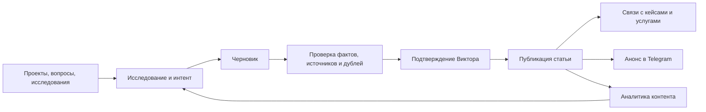
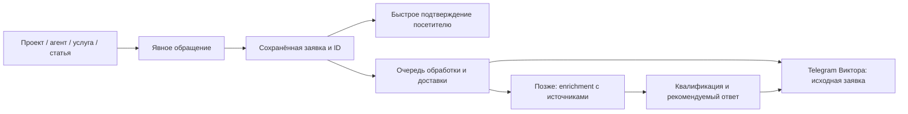

# VICTOR AI PORTFOLIO — SITE ARCHITECTURE AND DESIGN CONCEPT

Дата: 4 сентября 2026 года. **SITE DESIGN CONCEPT: READY.**

Новая архитектура с нуля. Документ готов для обсуждения и последующего технического задания; это не frontend, не окончательный выбор flagship-проектов и не разрешение на установку компонентов. `C:\OSPanel\home\myportfoliowebsite` не переделывается. Создан только этот файл.

## 1. Основания и ключевое решение

Основной источник — [MASTER BRIEF v2](<D:/AI Workflows/victor-ai-portfolio/VICTOR_AI_PORTFOLIO_MASTER_BRIEF_v2.md>), в особенности §2–13, §17–21. Использованы [сравнение референсов](<D:/AI Workflows/victor-ai-portfolio/research/REFERENCE_COMPARISON.md>), [карта KokonutUI](<D:/AI Workflows/victor-ai-portfolio/research/KOKONUTUI_COMPONENT_MAP.md>), [аудит локальных материалов](<D:/AI Workflows/victor-ai-portfolio/research/LOCAL_PORTFOLIO_MATERIALS_AUDIT.md>) и контекст [целевого аудита](<D:/AI Workflows/victor-ai-portfolio/research/TARGETED_PROJECT_EVIDENCE_AUDIT.md>).

Глобальная Memory проверена как контекст; запись о пустом проекте устарела относительно имеющихся research-файлов. Глобальный реестр Skills не содержит зарегистрированных пользовательских методик. Дополнительные материалы Knowledge для этой задачи не потребовались. Memory и исходные документы не изменялись.

**Рекомендуемая модель:** компактная главная объясняет предложение и ведёт к самостоятельным кейсам; каталог AI-агентов объясняет заказываемые решения; услуги задают формат работы; блог поддерживает эти страницы полезными материалами. Основной контент отдаётся индексируемым HTML, интерактивность добавляется только там, где помогает выбору или обращению.

Рабочая аудитория — владелец небольшого бизнеса или руководитель процесса с конкретной задачей: ответы по документам, обработка обращений, контент, интеграции, веб-сервис. Это гипотеза позиционирования, а не результат исследования спроса. Второй маршрут — преподаватель или технический партнёр, которому нужны роль автора, AI-составляющая и доказательства.

### Как используются референсы

| Источник | Берём принцип | Собственное решение |
|---|---|---|
| [Юлия Ионова](https://portfolio-beta-ruddy-31.vercel.app/#projects) | Ясный вход, лёгкая подача, короткий путь к работам | Один H1, короткое пояснение, два действия; проекты идут сразу после hero. Основные карточки открыты и не зависят от карусели |
| [Сергей Пименов](https://pimenov.ai/) | Самостоятельные разборы, связь контента и работы с автором | Страница кейса с результатом, источниками и ограничениями; статья ведёт к релевантной услуге и обращению. Не переносим большой граф знаний и многослойное меню |
| KokonutUI через shadcn MCP | Готовые визуальные паттерны | Три ограниченных применения после адаптации; библиотечные демоданные и декоративные сценарии не становятся содержимым сайта |

В этом проходе web открыл главную Пименова; ссылки на материалы, кейсы, форматы работы и Telegram видны. Web-инструмент не открыл URL Юлии (`not safe to open`), поэтому её подробная оценка взята из существующего исследования; это не заключение о недоступности сайта. Новый полный аудит референсов не выполнялся. Публичный интерфейс не доказывает устройство их закрытого backend.

### Граница доказанности проектов

Последнее продолжение evidence-аудита было прервано до сохранения. В сессии обнаружены рабочий `food.sama-mogu.site`, более поздний акт импорта Leftover Food и fallback-ответы помощника donskoe39; текущий TARGETED-файл ещё не отражает все эти уточнения. Поэтому его старые оценки не используются как автоматическое разрешение на публикацию карточек.

В архитектуре предусмотрены 3–4 места под сильные кейсы. Состав определяется завершённым evidence-аудитом. Если три подтверждённых AI-проекта ещё не готовы, нельзя объявлять выполненным соответствующий критерий MASTER BRIEF. Обычный web-проект может иметь честный отдельный кейс, но не учитывается как AI только по способу написания кода.

## 2. Sitemap и границы первого релиза

Ниже — предлагаемые маршруты, не созданные страницы. Принцип: **одна сущность — один основной URL**. Проект и его case study объединяются в `/projects/<slug>/`; отдельный дублирующий `/cases/<slug>/` не нужен. В интерфейсе раздел можно назвать «Проекты и кейсы».

```text
/                                      Главная
├── /projects/                         Все опубликованные проекты и кейсы
│   └── /projects/<slug>/              Полноценный кейс проекта
├── /ai-agents/                        Каталог решений Front / Back Office
│   └── /ai-agents/<type>/             Отдельный тип агента — по мере готовности
├── /services/                         Форматы разработки и интеграции
│   └── /services/<service>/           Полноценная страница услуги
├── /resources/automation-checklist/   Первый лид-магнит: практический чек-лист
├── /blog/                             Материалы и разборы
│   └── /blog/<slug>/                  Статья
├── /contact/                          Задача, форма, Telegram, email
├── /privacy/                          Политика обработки данных
├── /consent/                          Информация о согласии для формы
├── /cookies/                          Состав cookies/аналитики и управление выбором
├── /thank-you/                        Подтверждение приёма заявки; noindex
├── /404                               Реальный ответ 404 + полезные переходы
├── /robots.txt
└── /sitemap.xml
```

| Этап | Что выпускаем | Условие |
|---|---|---|
| MVP — коммерческая основа | Главная, `/projects/`, готовые кейсы, `/ai-agents/`, `/services/`, одна содержательная страница приоритетной услуги, `/contact/`, чек-лист, необходимые страницы обработки данных, robots/sitemap | Рабочие ссылки, утверждённые факты и один реальный лид-магнит. Для выполнения brief — минимум 3 проверенных AI-проекта |
| MVP — основа блога | Модель статьи, шаблон, taxonomy, связи и metadata; маршрут `/blog/` предусмотрен | Публичную индексируемую витрину и блок статей включаем с первым проверенным материалом. Пустой каталог не рекламируем; десятки статей до запуска не требуются |
| Следующий этап | Содержательные страницы типов агентов/услуг; статьи, Telegram-дистрибуция, Lead Intelligence и Analytics Agent | Реальная ценность каждой страницы и подтверждённый рабочий процесс |
| По фактическому росту | RSS, фильтры блога, отдельные темы и поиск | RSS — с устойчивым потоком статей; отдельная страница темы — при достаточном полезном содержимом, не ради количества URL |

Кандидаты URL из brief: `/projects/kmk-ai-consultant/`, `/projects/catch-job-bot/`, `/services/rag/`, `/services/n8n-automation/`, `/ai-agents/ai-consultant/`. Их наличие в sitemap концепции не означает публикацию или подтверждённую услугу. Для MVP не выпускать сразу десятки однотипных страниц. `/about/` пока не нужен: автор представлен на главной и внутри кейсов.

Каталог агента отвечает на вопрос **«что делает решение»**, страница услуги — **«как заказать его разработку и что входит в работу»**, кейс — **«что уже сделано и чем подтверждено»**. Это три разных назначения, а не три копии одного рекламного текста.

## 3. Главная: порядок блоков и содержание

| № | Блок / якорь | Что посетитель получает | Основное действие |
|---|---|---|---|
| 1 | HEADER | Имя, навигация, понятный вход в контакт | «Обсудить задачу» |
| 2 | HERO | Кто и какие решения создаёт | «Посмотреть проекты»; второе действие «Обсудить задачу» |
| 3 | РЕАЛЬНЫЕ AI-ПРОЕКТЫ `#projects` | 3–4 проверенных работы: задача, результат, роль, статус, доказательства | «Разобрать кейс» → `/projects/<slug>/` |
| 4 | AI-АГЕНТЫ ДЛЯ БИЗНЕСА `#agents` | Две открытые группы: для клиентов и для внутренних процессов | «Подобрать решение» → контекстный контакт |
| 5 | УСЛУГИ `#services` | Понятные форматы: AI/RAG, автоматизация/API, AI-сервисы и сайты | «Что входит в работу» → услуга |
| 6 | КАК Я РАБОТАЮ `#process` | Четыре этапа с результатом каждого | «Обсудить первый этап» |
| 7 | БЛОГ / МАТЕРИАЛЫ `#materials` | 2–3 опубликованных разбора реальной работы | «Читать разбор» |
| 8 | ЛИД-МАГНИТ `#resource` | Полезный чек-лист подготовки процесса к автоматизации | «Открыть чек-лист» |
| 9 | ОБО МНЕ `#about` | Портрет, специализация, подтверждённая роль и подход | Контекстная ссылка на кейс/контакт |
| 10 | КОНТАКТ `#contact` | Форма задачи, личный Telegram, email, следующий шаг | «Отправить задачу» |
| 11 | FOOTER | Повтор основной навигации, контакты, правовые страницы, канал | «Написать лично» / «Читать канал» отдельно |

Порядок: предложение → доказательство → варианты решения → формат работы → процесс → полезный контент → простой первый шаг → автор → контакт. Основные проекты не прячутся за большим блоком биографии и технологий. Лид-магнит доступен и из услуги/статьи, поэтому не зависит от прокрутки до восьмого блока.

### Hero: текстовая концепция

**Надзаголовок:** «Виктор Смирнов · AI и автоматизация».

**H1:** «От идеи до работающего AI-продукта».

**Пояснение:** «Разрабатываю AI-агентов, AI-сервисы, сайты и автоматизацию под конкретные задачи. В кейсах показываю, как устроено решение, что проверено и какие ограничения остались».

Это предложенный текст, который нужно согласовать с подтверждённой ролью автора перед публикацией. Не добавлять гарантий роста продаж, сроков «для любого проекта» или счётчиков клиентов без источников.

Первичное действие hero — **«Посмотреть проекты»** (якорь, работает без JS); вторичное — **«Обсудить задачу»**. Контакт остаётся доступен в header. Справа на desktop — один лёгкий составной визуал: фрагмент реального интерфейса и простая схема «задача → система → результат» с подписью конкретного проекта. Если проверенного screenshot ещё нет, оставить типографическую схему, явно обозначенную как принцип работы, а не имитацию продукта.

Не фиксировать hero на 100vh. На mobile сначала H1/пояснение/действия, затем небольшой визуал; начало проектов должно достигаться короткой прокруткой. Цель — понятность предложения в первом экране, не обязательное попадание всех элементов в любую высоту устройства.

### Схема desktop и mobile

```text
DESKTOP, до 1200 px содержимого
┌──────────────────────────────────────────────────────────────┐
│ Виктор   Проекты  AI-агенты  Услуги  Материалы   Обсудить задачу│
├───────────────────────────────────┬──────────────────────────┤
│ H1 + короткое пояснение            │ Реальный экран / схема   │
│ [Посмотреть проекты] [Обсудить]    │ Подпись и границы        │
├───────────────────────────────────┴──────────────────────────┤
│ Реальные AI-проекты: три равнозначные открытые карточки       │
│ [экран + факты + ссылка] [экран + факты] [экран + факты]        │
├──────────────────────────────┬───────────────────────────────┤
│ Для клиентов / Front Office │ Для команды / Back Office      │
├──────────────────────────────┴───────────────────────────────┤
│ Услуги: спокойная bento-сетка с понятными результатами         │
│ Процесс: задача → прототип → проверка → запуск/сопровождение   │
│ Материалы: 2–3 содержательных статьи                         │
│ Чек-лист: польза + [Открыть]                                 │
│ Обо мне: портрет + проверенные факты                         │
│ Контакт: задача + предпочтительный канал + что будет дальше  │
│ Footer                                                       │
└──────────────────────────────────────────────────────────────┘

MOBILE
Имя                              [Меню]
H1
Пояснение
[Посмотреть проекты]
Обсудить задачу →
Небольшой визуал
Проект 1 → Проект 2 → Проект 3 (обычная вертикальная лента)
Front Office → Back Office (обе группы доступны)
Услуги → Процесс → Материалы → Чек-лист → Обо мне → Контакт
Footer
```

На главной не нужны фильтры для трёх работ. При четырёх карточках desktop-сетка 2×2 вместо трёх маленьких и одной случайно растянутой. При отсутствии опубликованных статей блок материалов не показывает заглушки «скоро»; место сохраняется в архитектуре.

## 4. Карточка проекта

Главные карточки имеют одинаковую структуру и обычную ссылку на кейс. Превью и заголовок могут вести в одно место; не вкладывать кнопки/другие ссылки внутрь общей ссылки-контейнера.

```text
[Реальный screenshot / результат, с подписью типа артефакта]
AI-консультант · PROTOTYPE               Проверено: дата
Название проекта
Для кого и какую задачу решает — 1–2 строки
Результат: факт с единицей, периодом и источником
или: «Есть рабочий прототип; бизнес-эффект пока не измерен»
Моя роль: кратко, только подтверждённое
AI: конкретная функция                 [до 3 тегов стека]
Доказательства: demo / видео / код / проверка
[Разобрать кейс →]                       [Открыть demo ↗]
```

Постоянно видны название, задача, статус, роль, результат/его отсутствие, AI-функция и ссылка. Не обрезать статус или ограничение через line-clamp. Стек можно сократить; полный список — на странице. Внешний demo показывать только с известной доступностью; для недоступного дать запись и честную подпись, не притворяться живым приложением.

Разделять статус продукта `PRODUCTION / PUBLIC DEMO / MVP / PROTOTYPE / PAUSED / INCOMPLETE`, доступность ссылки и статус AI-проверки. Сайт может быть опубликован, пока его AI отвечает fallback; один зелёный бейдж не должен скрывать это. Статус не кодируется только цветом. Отсутствие метрики не заменяется демонстрационным процентом.

## 5. Карточка AI-агента и каталог

Две открытые группы с русским объяснением: **«Для клиентов — Front Office»**, **«Для команды — Back Office»**. Термины Front/Back Office не должны быть единственным объяснением.

Карточка содержит:

1. Название задачи: «Консультант по документам», «Помощник для обработки обращений».
2. Для кого и что получает человек на выходе.
3. Входные данные и 1–2 возможные интеграции.
4. Где нужен контроль человека и что агент не решает.
5. Однозначную подпись: **«Есть подтверждённый кейс»** со ссылкой или **«Разработка под вашу задачу»**.
6. CTA «Обсудить такого помощника» с контекстом типа решения.

Не публиковать весь перечень из brief как готовый продуктовый каталог. Для первого релиза достаточно нескольких содержательных типов, соответствующих реальным компетенциям. «Можно разработать» не означает продукт READY и не подтверждает существующую реализацию. Catch Job Bot не становится AI-рекрутером по одному названию; поиск заказов и подбор персонала — разные задачи.

Первоначально группы расположены рядом на desktop и последовательно на mobile. Smooth Tab не выбран для MVP: переключение скрывает половину небольшого каталога и требует значительной адаптации исходного примера. При росте каталога допустим фильтр «Все / Для клиентов / Для команды» с доступными ссылками на отдельные страницы; индексируемый контент не загружается только после клика.

## 6. Отдельная страница кейса

Порядок рассчитан на два уровня чтения: деловой итог в начале, техническое доказательство ниже.

| Блок | Обязательное содержание |
|---|---|
| Хлебные крошки и hero | Название, тип продукта, задача, статус, дата проверки, demo/код/запись |
| Краткий итог | Кому помогало решение, что создано, роль Виктора, подтверждённый результат или отсутствие измерений |
| До проекта | Исходный процесс, ограничение, требования; не выдумывать клиента для личного/учебного проекта |
| Что сделано | Реальный пользовательский сценарий и границы рассматриваемой версии |
| Как работает | Понятная схема данных, интеграций и зон ответственности |
| Что делает AI | Модель/провайдер по источнику, retrieval, инструменты, автоматизация, fallback и участие человека |
| Моя работа и инструменты | Постановка, данные, решения, реализация, проверка; отдельно помощь Codex/Claude/платформ без выдуманного процента авторства |
| Демонстрация | Вход → выход, 2–4 реальных экрана/фрагмента, подписи; видео только по действию |
| Доказательства | Документы, тесты и дата, release/commit при наличии, открытые источники. Локальный путь не выдаётся за доступное посетителю доказательство |
| Результат и эксплуатация | Методика измерения, выборка, период; что поддерживается после запуска; неизвестное указано явно |
| Ограничения | Ошибки, fallback, неготовые части, что нельзя обещать; рядом с соответствующим результатом, не только внизу |
| Связанные решения | Одна релевантная услуга/тип агента и 1–2 статьи |
| CTA | «Обсудить похожую задачу» → контакт с projectId |

На desktop — основная колонка чтения 680–760 px и необязательное компактное оглавление. На mobile оглавление раскрывается обычным контролом, тело кейса остаётся в документе. Подробности не превращать в десяток модальных окон. Длинные таблицы имеют подпись и отдельную горизонтальную прокрутку; страница целиком не должна расползаться.

Card Flip допустим только в дополнительном блоке «Как устроено» после основной схемы — детали см. §14. Его отсутствие не должно уменьшать фактическую полноту кейса.

## 7. Страница услуги

Структура: **результат услуги → кому подходит → типовые задачи → состав работ → реальные доказательства → процесс/участие клиента → границы → FAQ → лид-магнит → контакт**.

Например, для RAG: какой корпус нужен, что получит пользователь, как проверяются ответы, что происходит без источника, как обновляется база и какие ограничения остаются. Не превращать технические детали в обязательную анкету для первого контакта.

Формат карточек услуг на главной: название, задача, ожидаемый поставляемый результат, ссылка «Что входит». Три направления: **AI-агенты и RAG**, **автоматизация и API/Telegram/n8n**, **AI-сервисы и веб-продукты**. Последнее направление явно допускает обычные web-проекты; AI не приписывается каждой реализации.

Стоимость и сроки — только при утверждённом составе и условиях. До этого корректный CTA: «Описать задачу для оценки», без случайных «от» и обещаний ответа за установленное время. Отдельный тип агента описывает функцию; услуга — процесс поставки и границы ответственности.

## 8. Blog и управляемый автоконтент

Минимальная taxonomy: **кейсы и разборы**, **AI/RAG**, **автоматизация и интеграции**, **процесс разработки**. Это рубрики материалов, не четыре обязательных пустых SEO-раздела. Карточка статьи: тема, конкретная польза, дата публикации/обновления, связанный проект. Время чтения вычислять по тексту, не задавать фиктивно.

Шаблон статьи: H1 → краткий ответ/вывод → контекст → содержательные разделы → факты и источники → ограничения → связанный кейс/услуга → один уместный CTA. Из старого портфолио можно адаптировать тему вайбкодинга как разбор реального процесса; сам текст требует фактчекинга и примера.



Состояния материала: `draft → evidence_review → editorial_review → approved → published → needs_update`. У агентного черновика нет самостоятельного права публикации. Сбой генерации/аналитики не влияет на открытие уже опубликованных страниц. Не показывать на сайте имитацию работающего контентного агента до появления реального контура.

MVP предусматривает шаблон и связи; автоматическое исследование/черновики/дистрибуция развиваются отдельно. Редакторский контроль обязателен в первом контентном цикле по brief. Без реальных статей главная не засоряется демонстрационными карточками.

## 9. Лид-магниты: один полезный старт

**Рекомендованный первый материал:** «Готов ли ваш процесс к автоматизации? Чек-лист для первого разбора» на `/resources/automation-checklist/`.

Содержимое будущего материала: описание повторяющейся задачи; входные данные; частота и текущие затраты времени; исключения; нужные доступы; цена ошибки; критерий успешного результата; вопросы к разработчику. Выход — заполненное описание процесса, пригодное для обсуждения. Это самостоятельная польза, не обещание автоматического AI-диагноза. В этом задании сам лид-магнит не создаётся.

Полный текст доступен без обязательного email. В конце — «Обсудить мой процесс» с возможностью перенести ответы в форму после явного действия. Позже можно добавить оценочный калькулятор, но с вводными пользователя, явными допущениями и разделением оценки от измеренного ROI. Старые «рыночные цены» не использовать.

Места: самостоятельный блок главной; после FAQ услуги; в конце релевантной статьи; в кейсе — только если подходит к его задаче. Не показывать автоматический popup на первом визите и не закрывать проекты формой захвата.

## 10. CTA-map и путь заявки

| Контекст | Текст действия | Назначение | Контекст для формы / событие |
|---|---|---|---|
| Header | Обсудить задачу | `/contact/` | placement=header / contact_open |
| Hero, первичное | Посмотреть проекты | `/#projects` | projects_anchor_click |
| Hero, вторичное | Обсудить задачу | `/contact/` | placement=hero / contact_open |
| Карточка проекта | Разобрать кейс | `/projects/<slug>/` | project_open + projectId |
| Кейс | Открыть demo | Проверенный внешний URL | demo_click + projectId; это не успешное использование demo |
| Кейс, коммерческое | Обсудить похожую задачу | Контакт | projectId + placement=case |
| Тип агента | Подобрать решение | Контакт / краткий бриф | agentType; «подбор» не называется автоматическим без реализации |
| Услуга | Описать задачу для оценки | Контакт | serviceId |
| Статья | Посмотреть связанный кейс | Кейс | articleId + projectId |
| Чек-лист | Открыть чек-лист | Страница ресурса | resource_open; не lead |
| Форма | Отправить задачу | Серверный приём | lead_received только после сохранения |
| Прямой канал | Написать Виктору в Telegram | Подтверждённый личный адрес | telegram_click; не отправленная заявка |
| Footer | Читать канал | Подтверждённый канал | channel_click; не личное обращение |

Форма MVP: задача, предпочтительный контакт, имя по необходимости; компания/сайт необязательны. Согласие/информация об обработке привязаны к действующему процессу. Не требовать бюджет, должность, модель AI и архитектуру до первого разговора. Текст объясняет: «Опишите задачу и оставьте удобный контакт. Я изучу вводные и предложу следующий шаг». Срок ответа добавляется только после подтверждения Виктором.

Состояния формы: пустая → заполнение → отправка → сохранено / ошибка. Ошибка не стирает введённый текст. Подтверждение «Заявка принята» показывается после серверного сохранения, а не по факту клика или Telegram-доставки. При сбое доступен прямой контакт. Пустой success-screen без приёма данных запрещён.



Сохранение, доставка и enrichment имеют отдельные статусы. Предусмотреть идемпотентность отправки и повтор доставки без создания второго лида. Минимальное уведомление не должно ждать LLM. Enrichment запускается после явного обращения, не для деанонимизации всех посетителей. Подтверждённое, предположение и «не найдено» разделены; сведения о компании связываются с лидом только при достаточных основаниях. Текст заявки и персональные данные не передаются в общий поток аналитики.

Это архитектурное требование к будущей реализации. Базовая аналитика и рабочая связь нужны первому релизу; Lead Intelligence, Qualification и Analytics Agent подключаются позднее. Никакие уведомления, автоматизации или агенты этим документом не включены.

## 11. Mobile navigation и доступность

Header на mobile: имя/короткий wordmark слева, видимая кнопка **«Меню»** справа; высота около 64 px. Меню содержит Проекты, AI-агенты, Услуги, Материалы (когда есть), Обо мне и Контакт. Ссылки ведут на реальные страницы/якоря. Header sticky без постоянного скрытия при прокрутке; якорям задать отступ под него.

Основное меню — простое доступное раскрытие под header, не карусель, не боковая панель с вложенными уровнями. Кнопка имеет aria-expanded/aria-controls, закрывается по Escape и выбору ссылки; фокус при закрытии возвращается на кнопку. Без JS навигационные ссылки остаются доступны в документе. У немодального раскрытия нет искусственного focus trap.

Smooth Drawer используется **только для короткого брифа/выбора канала**, не как единственный маршрут контакта и не как основное меню. Полная `/contact/` остаётся рабочей альтернативой. Drawer должен иметь заголовок, кнопку закрытия, управляемый фокус, Escape, корректную прокрутку и safe-area; свайп не единственный способ закрытия. Поведение модального диалога проверяется по [WAI-ARIA Dialog Pattern](https://www.w3.org/WAI/ARIA/apg/patterns/dialog-modal/).

Проектные цели: интерактивная область не меньше 44×44 CSS px; поля не меньше 16 px шрифта; видимый focus; meaningful labels; ошибки связаны с полями. Проверять ширины 320/360/390/768 px, увеличение текста и экранную клавиатуру. Не перекрывать форму одновременными sticky CTA, чатом и cookie-баннером. В MVP достаточно CTA в header и контенте; постоянно плавающий чат не нужен.

## 12. Визуальное направление

**Рекомендация: светлая редакционная подача с тёмным графитовым текстом, глубоким зелёно-бирюзовым акцентом и реальными экранами продуктов.** Впечатление — авторская инженерная практика: спокойно, понятно, с вниманием к деталям. Индивидуальность создают портрет, доказательства, собственные схемы и формулировки.

Основная поверхность светлая, что облегчает длинное чтение кейсов. Тёмные вставки допустимы для схем и отдельных screenshot-рамок, не через чередование тяжёлых полноэкранных секций. В первом релизе достаточно одной тщательно проверенной темы; отдельная dark theme не должна задерживать запуск и требует собственных токенов/контраста.

### Цвета — предлагаемые токены

| Роль | Значение | Применение |
|---|---|---|
| Page | `#F7F8F6` | Основной светлый фон |
| Surface | `#FFFFFF` | Карточки и форма |
| Ink | `#17211F` | Заголовки и основной текст |
| Muted | `#4D5C56` | Вторичные подписи, не для скрытия ограничений |
| Accent | `#0F6657` | Основные действия и ссылки |
| Accent hover | `#0B4D42` | Hover/active |
| Accent tint | `#E7F2ED` | Подложка выделения |
| Border | `#D7DFDA` | Разделители; не единственная видимая граница обязательного поля |
| Focus | `#2459A6` | Контрастное кольцо фокуса |
| Warning / Error | `#8A4B08` / `#A52A36` | Статусы с текстом и пиктограммой, не только цветом |

Градиент использовать на рамке/подложке одной первичной CTA-кнопки, не на основном тексте страницы. В адаптации Gradient Button текст сделать сплошным и достаточно насыщенным. Предлагаемые токены ещё не прошли проверку всех комбинаций и состояний. Цель: минимум 4.5:1 для обычного текста и 3:1 для крупного согласно [WCAG Contrast Minimum](https://www.w3.org/WAI/WCAG22/Understanding/contrast-minimum.html).

### Typography

Одна гарнитура **Inter с кириллицей**, self-hosted WOFF2 после проверки используемого файла/лицензии. Обычный system sans — fallback. Начать с 400/500/600/700 или одного оправданного variable-файла; не загружать отдельную display-гарнитуру только для hero. Технические идентификаторы — системный monospace, не весь интерфейс.

| Роль | Mobile | Desktop | Правило |
|---|---|---|---|
| Hero H1 | 36–40 px | 56–64 px | line-height 1.08–1.15, без жёстких переносов для одной ширины |
| H2 | 28–32 px | 36–40 px | line-height около 1.2 |
| H3 / карточка | 20–22 px | 22–24 px | Короткое понятное название |
| Основной текст | 16–18 px | 18 px | line-height 1.55–1.65 |
| Подписи/бейджи | 14 px | 14 px | Нельзя уменьшать ради размещения статуса |
| Кнопка | 16 px, 600 | 16 px, 600 | Понятное действие без all caps |

Длина строки кейса — примерно 60–75 символов. Не использовать выравнивание по ширине и отрицательный tracking для основного кириллического текста. H1 hero — максимум несколько коротких строк, без эффекта печатной машинки.

### Spacing и grid

Шкала отступов: **4 / 8 / 12 / 16 / 24 / 32 / 48 / 64 / 96 px**. Mobile gutters 20 px (16 на 320 px), tablet 24, desktop 32. Контейнер до 1200 px. Между секциями 56–64 px mobile и 80–96 desktop; внутри карточки 20–24 px. Радиус карточек 16 px, контролов 10–12 px; тень слабая, разделение в основном через фон/границу.

Сетка проектирования: 4 колонки mobile, 8 tablet, 12 desktop. Реальный контент на mobile — одна колонка. CSS расширяется через min-width: примерно 640 / 960 / 1200 px, но точки менять по содержимому, а не под названия устройств. Hero desktop 7/5; проекты — 3 равные карточки либо 2×2; услуги — bento с одной ведущей и двумя дополнительными областями. На mobile все bento-элементы становятся обычным последовательным списком. DOM-порядок совпадает с порядком чтения; masonry не нужен.

## 13. Изображения и motion rules

Принцип изображений: **сначала продукт и доказательство, затем автор, затем декор**.

- Реальные screenshots с понятной датой/версией и подписью. На превью виден общий интерфейс, важную деталь показывать отдельным увеличением на кейсе. Не маскировать ошибку декоративной обложкой.
- Для AI-пайплайна допустим реальный выходной артефакт — кадр, документ, пример ответа; подпись объясняет, что это. Архитектурная схема не называется screenshot.
- Карточки используют единое внешнее соотношение около 16:10; исходный UI не обрезается так, чтобы скрыть существенную часть. У схем и документов возможен contain. Все размеры резервируются заранее.
- Портрет старого сайта — кандидат после подтверждения актуальности; старые иллюстрации — только после проверки происхождения и смысла. Логотипы продуктов не превращать в фиктивные логотипы клиентов/партнёров.
- AVIF/WebP при разумном качестве, srcset/sizes, lazy-loading ниже первого экрана. Приоритет только действительно ключевому изображению. Видео с poster и явным Play; без autoplay и автозагрузки тяжёлого embed.
- Alt описывает полезное содержимое; декоративный визуал имеет пустой alt/скрыт от accessibility tree. Важные факты остаются текстом рядом.

Motion: 120–180 ms для feedback, 180–240 ms для раскрытия, до 300 ms для редкого поясняющего перехода. Это проектные ориентиры. Анимируются преимущественно opacity/transform. Нет бесконечного пульса, тикеров, счётчиков, canvas-фона, parallax, scroll hijack и задержки появления основного контента. Не использовать размытие текста при смене вкладки.

`prefers-reduced-motion` отключает 3D/перемещения и декоративную анимацию; содержание остаётся доступным. Начальное состояние основного контента видимо даже без JS. Hover лишь усиливает уже понятное действие, не открывает единственный CTA. Автоанимация за пределами viewport не нужна.

## 14. KokonutUI: проверка пяти компонентов и shortlist

Через существующий **shadcn MCP** выполнены `search_items_in_registries`, `view_items_in_registries` и `get_item_examples_from_registries` для `@kokonutui`. Прочитаны метаданные всех пяти позиций и код соответствующих примеров. Поиск Card Flip дополнительно вернул нерелевантный flow-field; он исключён. Установки и init не выполнялись.

MCP показывает React/Tailwind-примеры; код некоторых компонентов импортирует `next/link`, `next/image`, локальные Button/Drawer и utils. Сводка Dependencies не равна полному дереву зависимостей. Статический просмотр устанавливает риски, но не доказывает размер bundle, browser compatibility или accessibility после адаптации. Код примеров содержит MIT-атрибуцию; при будущем использовании нужно сохранить соответствующие условия.

| Компонент | Где и зачем | UX / mobile | Performance по коду | Accessibility и обязательные изменения | Решение |
|---|---|---|---|---|---|
| [gradient-button](https://kokonutui.com/r/gradient-button.json) | Основное действие hero «Посмотреть проекты»; выбранные контактные действия в других секциях | Ясный акцент. Исходная высота h-12; длинная русская подпись должна помещаться без обрезки | 1 файл; собственный Motion не импортирует, но зависит от локального Button/utils; несколько градиентных слоёв и теней | Убрать прозрачный градиентный текст/font-light; проверить focus/disabled/contrast. Для перехода нужен настоящий `<a>`, исходный button нельзя просто выдавать за ссылку | **Выбран №1**, после облегчения и корректной семантики |
| [bento-grid](https://kokonutui.com/r/bento-grid.json) | Три формата услуг: визуальная иерархия и связь задачи с результатом | Вариативность полезна для услуг; основные кейсы остаются равными карточками. Mobile — один столбец в DOM-порядке | 8 файлов по MCP, `motion`/`lucide-react`; next/link и иконки моделей; tilt/mousemove, таймеры counters/typing, имитация voice. Пример существенно сложнее простой CSS-сетки | Удалить fictitious metrics, «trusted partners», voice-demo, typing и tilt. Видимый контент без гидратации; обычные ссылки, без вложенных интерактивных элементов | **Выбран №2 как адаптированный визуальный паттерн**; сохраняем композицию, не весь showcase |
| [smooth-tab](https://kokonutui.com/r/smooth-tab.json) | Возможный поздний фильтр большого каталога | В примере toolbar 400 px, 4 колонки, панель 200 px: не подходит напрямую для mobile и длинного контента | `motion`/`lucide-react`, измерение layout, анимация blur/slide и бесконечная волна | Есть role=tab и aria-selected, но клавиатура обрабатывает только Enter/Space; при tabIndex=-1 остальным вкладкам нужны стрелки/Home/End. aria-controls не имеет соответствующих panel ID в показанной разметке. Нужны связанные tabpanel и reduced-motion | **Не выбран для MVP**; две группы агентов показываем открыто |
| [smooth-drawer](https://kokonutui.com/r/smooth-drawer.json) | Краткий бриф/выбор канала после явного CTA; полная `/contact/` остаётся доступна | Удобный короткий шаг на телефоне. Не предназначен для длинного меню или подробного кейса; проверить экранную клавиатуру и safe-area | 1 файл по MCP, `motion`; также импортирует Drawer/Button, lucide и Next Image/Link. Spring/stagger, повторяющаяся иконка в примере избыточны | Удалить pricing и ссылку Kokonut Pro; основной action в примере жёстко ведёт на pricing, передача props сама это не исправляет. Проверить Title/Description, focus trap/return, Escape, close, scroll. Убрать бесконечный motion | **Выбран №3 условно**, после адаптации; загружать по необходимости, не включать в критический путь hero |
| [card-flip](https://kokonutui.com/r/card-flip.json) | Только дополнительная деталь архитектуры внутри отдельного кейса | Не помогает первому сравнению проектов. Hover-only в исходнике; touch/keyboard неполноценны; max-width 280 и высота 320 px требуют пересмотра | 1 файл, `lucide-react`, React state/CSS; нет Motion-import, но есть повторяющиеся декоративные слои и 3D. CSS дешевле не означает отсутствие затрат | Код уже содержит motion-reduce для части анимаций, но это не решает доступность оборота. Нужен явный toggle, доступное альтернативное представление и исключение скрытых контролов из фокуса | **Опционально позже**, не входит в выбранные три |

Клавиатурную модель возможных вкладок сверять с [WAI-ARIA Tabs Pattern](https://www.w3.org/WAI/ARIA/apg/patterns/tabs/); наличие aria-атрибутов в библиотечном примере само по себе не означает соответствия этому паттерну.

### Как именно допустим Card Flip

В нижнем техническом блоке одного кейса: маленькая иллюстрация «Путь запроса» / «Обработка отсутствия данных». Заголовок, ключевая схема, статус, ограничения и ссылка на доказательства находятся **вне переворачиваемой области** и доступны постоянно. Под визуалом — обычная кнопка «Показать дополнительную схему»; keyboard/touch работают без hover. Для reduced-motion и без JS — две статические схемы с подписями.

Не переносить внутрь Flip название проекта, роль Виктора, результаты, maturity, предупреждение о prototype или единственную ссылку «Кейс». Если дополнительная схема не объясняет ничего существенного, компонент не нужен. Максимум один такой элемент на странице; не ставить на hero и в основной список проектов.

### Что выбранные три означают на практике

1. **Gradient Button:** визуальный акцент, адаптированный к обычной ссылке/действию.
2. **Bento Grid:** композиция блока услуг, очищенная от showcase-логики.
3. **Smooth Drawer:** короткое действие по запросу посетителя, с полной страницей-альтернативой.

Это рекомендации для будущего выбора Виктора, не команда установки. Не устанавливать все зависимости ради демонстрации. Если адаптация нарушает бюджет/доступность или выбран другой runtime, использовать эквивалентный простой паттерн; не менять архитектуру сайта только ради компонента. Полный frontend stack здесь не фиксируется.

## 15. Performance rules

Архитектурное правило: страницы и доказательства доступны как HTML с минимальным JS; AI, формы, меню и необязательные эффекты — отдельные интерактивные области. Статическая генерация или серверный рендер выбираются следующим техническим решением по хостингу и контенту. Клиентская SPA не нужна как условие просмотра портфолио.

Предлагаемые **проектные бюджеты**, не результаты замеров и не числа из MASTER BRIEF:

| Показатель | Цель первой реализации | Как проверять позже |
|---|---|---|
| Начальный first-party JS главной | До 100 KiB compressed, включая выбранный runtime | Production network/bundle; отложенные модули учитывать отдельно |
| Начальный CSS | До 40 KiB compressed | Network; удалить неиспользуемые showcase-стили |
| Шрифты первого просмотра | До 120 KiB суммарно | Кириллица/латиница, фактические файлы; не preload всех начертаний |
| Изображение hero | До 160 KiB в мобильном варианте | Визуальная читаемость и network; меньше при возможности |
| Первоначальная передача главной | До 600 KiB до действий пользователя | Холодный визит, отдельно сценарии consent; без видео/AI SDK на первом экране |
| Сторонние embeds/AI | Не участвуют в первом показе контента | Request waterfall и поведение при недоступной интеграции |

Цели CWV: **LCP ≤ 2,5 s, INP ≤ 200 ms, CLS ≤ 0,1** на 75-м процентиле отдельно для mobile/desktop. Это рекомендации [Web Vitals](https://web.dev/articles/vitals). До появления полевых данных использовать согласованный профиль лабораторной проверки и честно подписывать его; Lighthouse не подтверждает реальный полевой INP.

Зарезервировать размеры media/блоков, не скрывать hero до hydrate, не добавлять Motion во весь layout ради одного drawer. Изображения ниже viewport ленивые; hover не предзагружает тяжёлое видео. Анимации без постоянных layout reads. Аналитика не блокирует рендер, её отказ не ломает навигацию/контакт. Не давать обещание оценки Lighthouse 100 без измерения.

## 16. SEO-by-design

Основой являются требования MASTER BRIEF, а не копия структуры референса. Понятные URL, полезное уникальное содержание и ссылки помогают навигации и обнаружению страниц; конкретные позиции и включение в индекс не гарантируются. См. [Google SEO Starter Guide](https://developers.google.com/search/docs/fundamentals/seo-starter-guide).

Проектные правила:

1. Для каждого опубликованного route — уникальные title/description, один основной H1, последовательная иерархия, осмысленные ссылки и alt. Основной текст доступен в HTML.
2. Один canonical на собственный окончательный домен; домен пока не выбран. Не использовать домены референсов или `.local` в production metadata. Единая политика slash/HTTPS/host.
3. Sitemap включает только опубликованные канонические страницы; даты соответствуют содержательным обновлениям. Robots доступен. Preview закрыт от посторонних и индексации; robots не считается защитой приватных данных.
4. `/thank-you/`, черновики, служебный поиск/фильтры не формируют самостоятельные индексируемые SEO-страницы. Запросы/UTM не дублируют canonical. Не помещать персональные данные в URL.
5. Для отсутствующих материалов — настоящий HTTP 404; для перемещённых — уместный постоянный redirect. Не перенаправлять все ошибки на главную.
6. Структурированные данные только по реальному содержанию: Person для автора, BreadcrumbList для иерархии, Article для статей, корректный тип проекта/услуги при необходимости. Не добавлять вымышленные Review/AggregateRating и не обещать rich results.
7. Перелинковка: статья → релевантный кейс → тип агента/услуга → лид-магнит/контакт. У проекта одна основной страница, даже если он появляется в нескольких каталогах.
8. SEO-страница агента и услуга не повторяют друг друга. Новая страница появляется при отдельной задаче/интенте, собственном материале и проверяемом примере; не генерировать десятки замен названия города/отрасли.
9. OG-изображение и social metadata формируются из фактов страницы; в карточках распространения не придумывать показатели. Абсолютные URLs media, корректные размеры.
10. После публикации — подключение Search Console/Яндекс Вебмастера, проверка индексации, canonical и ошибок. Analytics/контентные выводы используются для обновления полезных материалов, а не увеличения объёма автотекстов.

Первичные тематические кластеры — гипотезы до семантического исследования: AI-консультант по документам/RAG; Telegram/n8n/API-автоматизация; AI-контентный pipeline; разработка AI/web-продукта. Кейсы должны давать им предметные доказательства. Не заявлять поисковый спрос и частотность без исследования.

## 17. Модель контента и управление достоверностью

Заложить независимые сущности **Project, AgentType, Service, Article, Evidence, Resource, Lead**. На первом этапе достаточно управляемых структурированных файлов/простого контентного слоя; конкретная CMS выбирается позже. Для каждой сущности стабильный ID, slug, связи и publication state.

Project хранит задачу, аудиторию, роль автора, runtime-статус, дату проверки, AI-составляющую, ограничения и evidence IDs. Evidence хранит тип, дату, версию, URL/артефакт, проверенный scope, доступность и разрешение на публикацию. Метрика отдельно хранит значение, единицу, период, выборку и метод. Отсутствие поля — неизвестно, а не ноль и не успех.

Статус редактирования (`draft / reviewed / published`) не равен статусу продукта. Публикационный gate проверяет ссылки, атрибуцию, ограничения и обязательные поля; для public evidence из private репозитория нужен доступный посетителю разрешённый артефакт. Путь на локальном диске нельзя выдавать за публичное доказательство.

AgentType связан либо с реальным Project, либо помечен предложением разработки. Article имеет источники и историю редакторской проверки. Resource публикуется только когда полезный материал действительно существует. Lead и история обработки не попадают в публичную CMS или AI-контекст для посетителей.

Базовые события: просмотр кейса/услуги, переход к доказательству, открытие ресурса, вход в контакт, сохранённая заявка, внешний Telegram-click. Click не считается квалифицированным лидом. Analytics Agent позже анализирует агрегаты и предлагает действия; он не меняет публичные достижения и статусы проектов автоматически.

## 18. Что использовать из старых материалов и чего избегать

ADAPT: подтверждённый портрет, вопросы FAQ, описание процесса, словарь услуг и тема статьи. REFERENCE ONLY: состояния формы, chips, контракты Capture/Telegram, отдельные визуальные идеи. Реальные project assets берутся из своих проектов с проверкой происхождения. Источником служит LOCAL-аудит; повторного обследования старого сайта здесь нет.

Не использовать:

- Абстрактные услуги как «выполненные работы», декоративные панели как реальные screenshots, шаблонные счётчики как результаты.
- Гарантии роста продаж, ROAS, число клиентов и «экономию» без подтверждения.
- Непроверенные ссылки/соцсети, фиктивное сообщение об успешной заявке, имитацию AI-подбора и прослушивания микрофона из demo-компонентов.
- Весь каталог Front/Back Office с одинаковым READY, чужие логотипы под заголовком «нам доверяют».
- Карточки с критическим содержимым на обороте, главную-карусель, бесконечные анимации и тяжёлый hero.
- Дубли `/projects` и `/cases` с одним текстом; десятки пустых SEO-страниц; блог без связи с задачами и продажами.
- Полный перенос старой PHP/Supabase-схемы или frontend framework только потому, что материалы уже есть.

## 19. Что делать первым в разработке

**Первый технический результат следующего разрешённого этапа:** один вертикальный фрагмент «главная → одна настоящая страница кейса → контакт» с семантическим HTML, новыми токенами, mobile-navigation и metadata. Сначала ясность и проверяемый контент; декоративные компоненты подключаются после проверки этого пути.

Перед этим завершить уточнения evidence-аудита и выбрать один кейс для наполнения, подтвердить личный контакт и роль автора. Затем принять короткое техническое решение о рендере, хостинге, контентном слое и форме; архитектура не требует переиспользовать старый стек. Отсутствие окончательных TOP-3 не мешает проектировать шаблон, но мешает объявлять весь MVP готовым по brief.

Порядок дальнейших работ:

1. Контентная модель и первый проверенный кейс; согласование Hero/ключевой услуги.
2. Техническое решение и статический/серверный каркас главной, кейса и контакта без motion.
3. Проверка 320–390 px, клавиатуры, текстовой иерархии и пути к доказательству.
4. Реальный приём заявки, обработка ошибок, базовые события и один полезный лид-магнит.
5. Выбор Виктором 1–3 компонентов; только после отдельного разрешения — установка/адаптация и проверка влияния на бюджет.
6. Остальные готовые кейсы, каталог, услуги и основа блога; SEO/доступность/performance-проверки.
7. Публикация только отдельным заданием; далее enrichment, аналитические агенты и управляемый content pipeline.

Ни один из этих шагов разработки в текущем задании не выполнялся.

## 20. Итоговые рекомендации

1. **Структура сайта:** главная, проекты с полноценными кейсами, отдельный каталог AI-решений, услуги, материалы, один ресурс-лид-магнит и контакт. Рост по содержанию, без дублирующих каталогов.
2. **Главная:** Header → Hero → реальные AI-проекты → Front/Back Office → услуги → процесс → материалы → лид-магнит → автор → контакт → Footer.
3. **Визуальный стиль:** светлая редакционная композиция, графитовый текст, зелёно-бирюзовый акцент, Inter, реальный продуктовый визуал, спокойная сетка.
4. **Три KokonutUI:** Gradient Button, адаптированный Bento Grid, Smooth Drawer для короткого брифа. Ничего не установлено; исходные примеры требуют изменений.
5. **Card Flip:** только необязательная дополнительная схема внутри кейса, с явным переключателем и статическим альтернативным представлением. Критические факты всегда вне оборота.
6. **Избегать:** декоративного шума, hover-зависимых действий, неподтверждённых достижений, фальшивых AI-сценариев и избыточной SEO-структуры.
7. **Первым разрабатывать:** один проверяемый путь от новой главной через реальный кейс к контакту, после уточнения его фактов и технического решения.

**SITE DESIGN CONCEPT: READY.** Все 19 запрошенных направлений описаны, пять компонентов проверены через MCP, три рекомендованы. Открытые решения — фактический состав кейсов, окончательный домен/stack, подтверждённые контакты и выбор компонентов перед установкой — относятся к следующим этапам. Создан только `research/SITE_ARCHITECTURE_AND_DESIGN_CONCEPT.md`; frontend, пакеты, исходные проекты и существующие исследования не изменялись.
